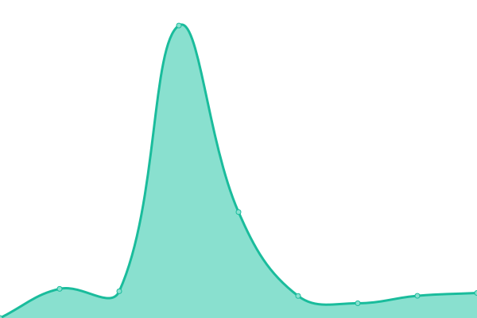
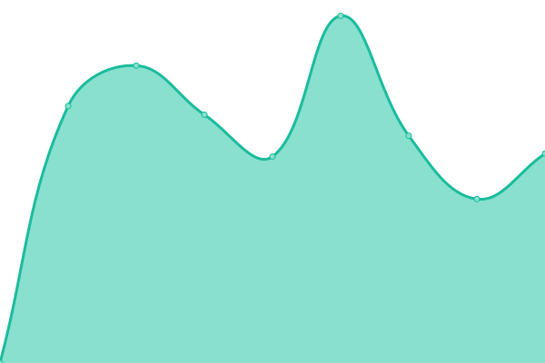

# [📈 Live Status](https://demo.upptime.js.org): <!--live status--> **🟩 All systems operational**

This repository contains the open-source uptime monitor and status page for [Upptime](https://upptime.js.org), powered by [Upptime](https://github.com/upptime/upptime).

With [Upptime](https://upptime.js.org), you can get your own unlimited and free uptime monitor and status page, powered entirely by a GitHub repository. We use [Issues](https://github.com/upptime/upptime/issues) as incident reports, [Actions](https://github.com/benjaminsimier/uptime/actions) as uptime monitors, and [Pages](https://demo.upptime.js.org) for the status page.

<!--start: status pages-->
<!-- This summary is generated by Upptime (https://github.com/upptime/upptime) -->
<!-- Do not edit this manually, your changes will be overwritten -->
<!-- prettier-ignore -->
| URL | Status | History | Response Time | Uptime |
| --- | ------ | ------- | ------------- | ------ |
|  [Benjamin Simier](https://www.benjaminsimier.com) | 🟩 Up | [benjamin-simier.yml](https://github.com/benjaminsimier/uptime/commits/HEAD/history/benjamin-simier.yml) | 

 5468ms
     
 | 

<a href="https://benjaminsimier.github.io/uptime/history/benjamin-simier">99.78%</a>
    

|  [Tanzanie Adventure Safaris](https://www.tanzanieadventuresafaris.co.tz) | 🟩 Up | [tanzanie-adventure-safaris.yml](https://github.com/benjaminsimier/uptime/commits/HEAD/history/tanzanie-adventure-safaris.yml) | 

 778ms
     
 | 

<a href="https://benjaminsimier.github.io/uptime/history/tanzanie-adventure-safaris">100.00%</a>
    

|  [AGLB Sophrologue](https://aglb-sophrologue.fr) | 🟩 Up | [aglb-sophrologue.yml](https://github.com/benjaminsimier/uptime/commits/HEAD/history/aglb-sophrologue.yml) | 

 5450ms
     
 | 

<a href="https://benjaminsimier.github.io/uptime/history/aglb-sophrologue">99.84%</a>
    

|  [La Fine Bouche Camion](https://www.lafinebouchecamion.fr) | 🟩 Up | [la-fine-bouche-camion.yml](https://github.com/benjaminsimier/uptime/commits/HEAD/history/la-fine-bouche-camion.yml) | 

 1895ms
     
 | 

<a href="https://benjaminsimier.github.io/uptime/history/la-fine-bouche-camion">99.79%</a>
    

<!--end: status pages-->

[**Visit our status website →**](https://demo.upptime.js.org)

## 📄 License

- Powered by: [Upptime](https://github.com/upptime/upptime)
- Code: [MIT](./LICENSE) © [Upptime](https://upptime.js.org)
- Data in the `./history` directory: [Open Database License](https://opendatacommons.org/licenses/odbl/1-0/)
